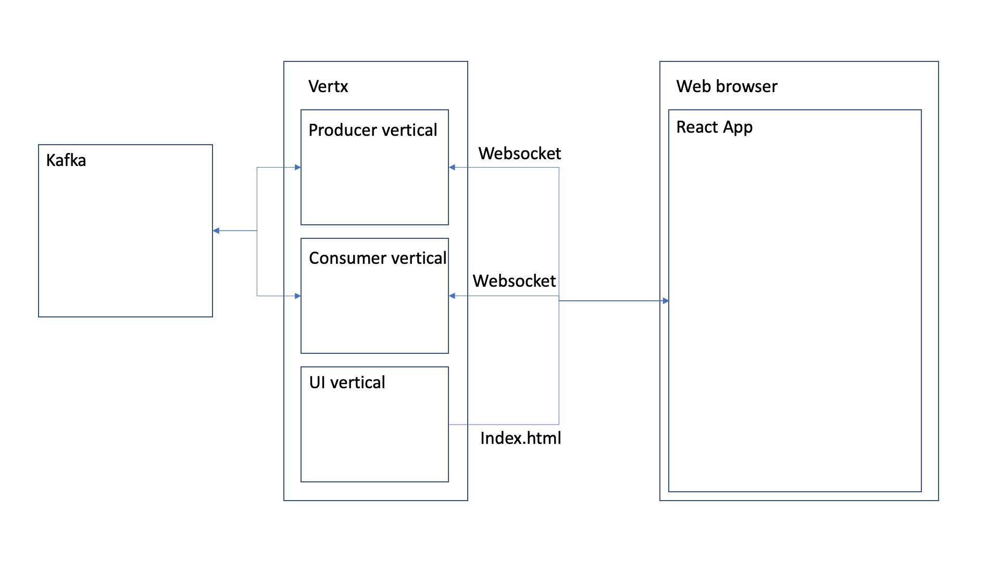
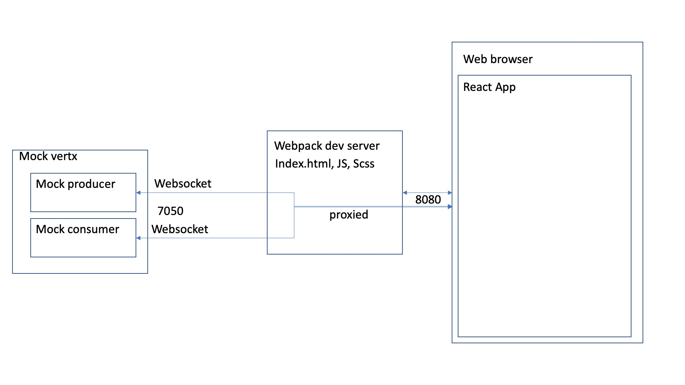
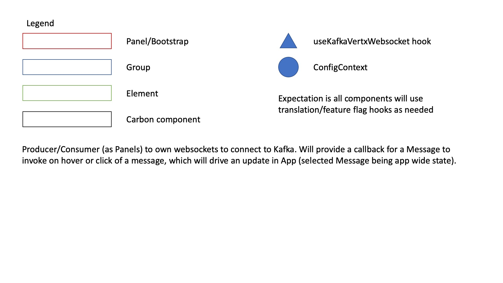
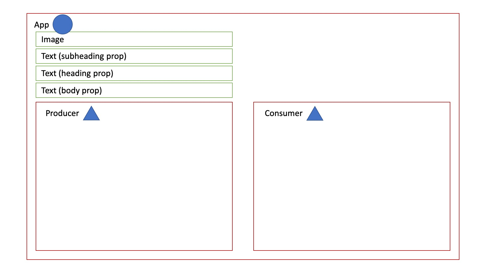
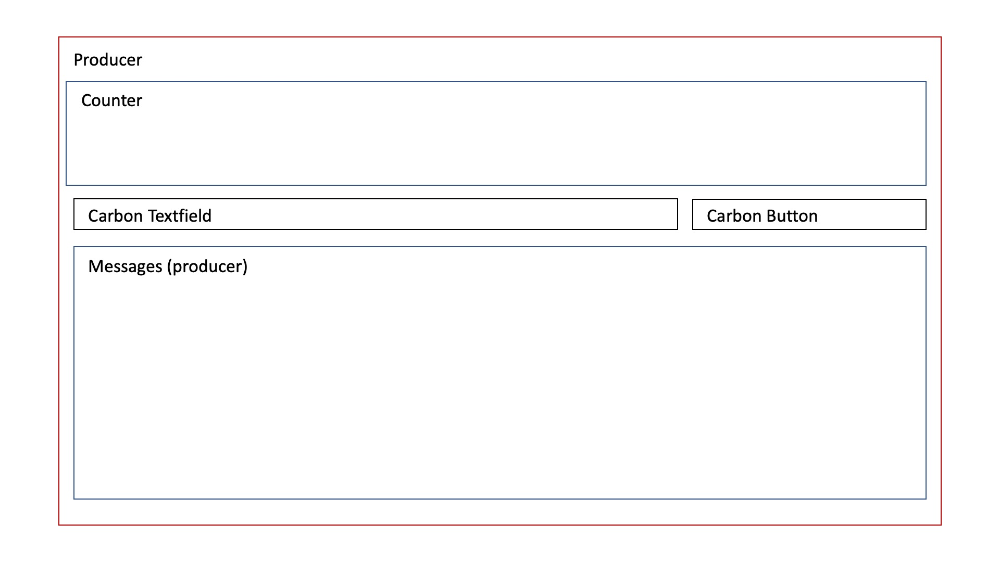
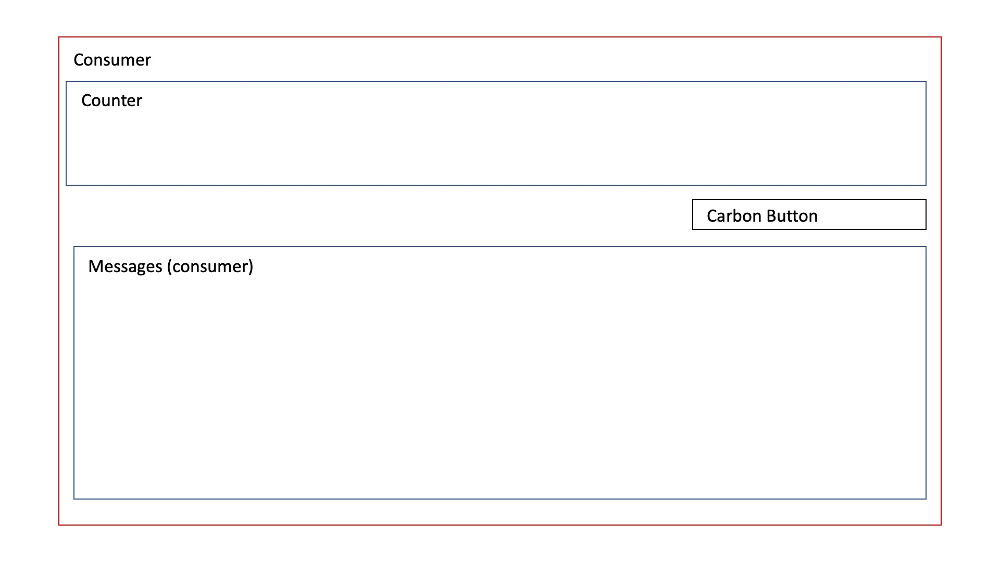
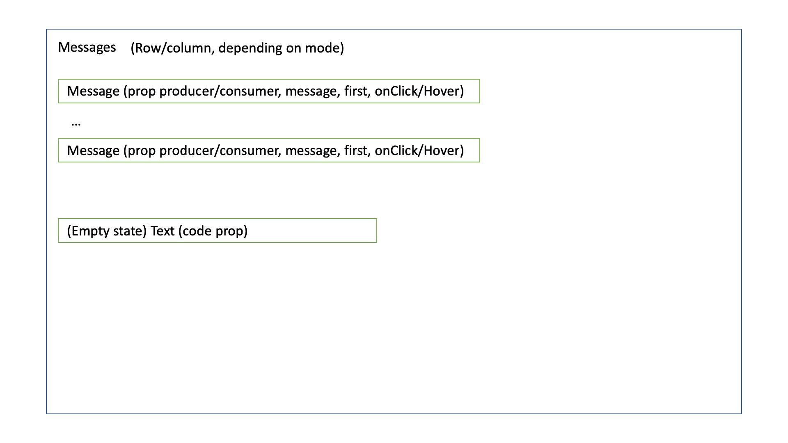
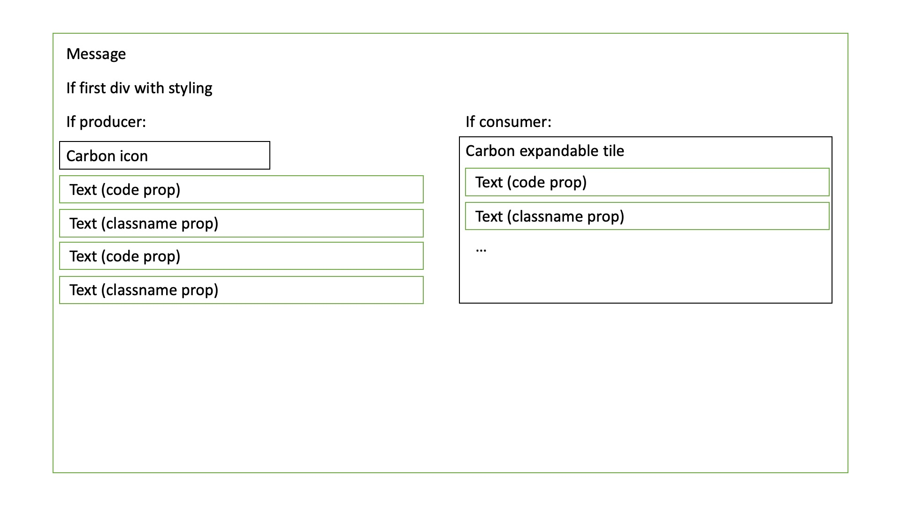

# Architecture

The UI for the starter application is implemented using React, as well as a set
of other dependancies, such as Webpack for build and Jest as a test runner. The
UI however is one part of the whole starter application.

The following documentation will describe the topology of the starter 
application when developing the UI, as well as when it is deployed as a
part of the fully built starter application. In addition, it will describe
the composition of React components used to build up the UI.

## Topology summary

### When deployed

The starter application's topology when run by a user will resemble the 
following:

When running the Jar file, a Vertx server will be started, which in turn will
launch three verticles. One verticle will handle records being produced to
Kafka, one verticle will handle records being consumed from Kafka, and finally
the third verticle deployed will server the UI when requested, along with all
supporting content, such as fonts and images. The producer and consumer 
verticles are configured to access Kafka via configuration provided by the user
at start up.

Once running, the user access the the endpoint serving UI content. This returns
the index.html, which will in turn contain script and source tags which will
pull all required styling and JavaScript to run the UI. The index.html will 
also contain a `meta` tag, which will contain configuration the UI will need to
operate with. It would for example contain the name of the topic this 
application has been configured to produce and consume from.

Once all required JS and style resources have been retrieved, the UI's `App`
component (detailed below) will bootstrap the rest of the UI. This will in turn
cause two websocket connections to be created - one for the producer, and one
for the consumer. These websockets are then driven and interacted with as the
user uses the application.

### When developing the UI

When the UI is developed, the topology used is different versus a normal 
deployment:

In this case, the UI, and all its assets, will be served via webpack-dev-server.
webpack-dev-server enables faster UI development by offering capabilities such
as hot reloading of code changes into the UI. To provide data to the ui, an
instance of a mock vertex server will be started. This will serve and act in
the same way as the real vertx instance which would be connected to Kafka.

## UI Structure

As mentioned, the UI is implemented using React. React components are intended
to be composable and reusable across a UI. In addition, via React Hooks, common
business logic can be similarly abstracted away for use in multiple components.

As per the [CodeStyle guidelines](./CodeStyle.md), we have deliberately categorised 
components into one of 4 types, to help maintain this composable nature. These 
types, and further details about them, can be found below:

- [`Elements`](../src/Elements/README.md) - presentational components
- [`Groups`](../src/Groups/README.md) - 0 to many `Element` components, with some business logic
- [`Panels`](../src/Panels/README.md) - 0 to many `Element` and `Group` components, with page level business logic/state ownership
- [`Bootstrap`](../src/Bootstrap/README.md) - UI bootstrap code

These component types have a direct influence on the hierarchy of the UI's 
construction, and where items such as state and business logic should exist.

The following diagrams show the current UI component hierarchy, from top down,
and how they interact:

Legend:

Top level (Bootstrap):

Producer (Panel):

Consumer (Panel):

Status (Group):

Messages (Group):

Message (Element):

